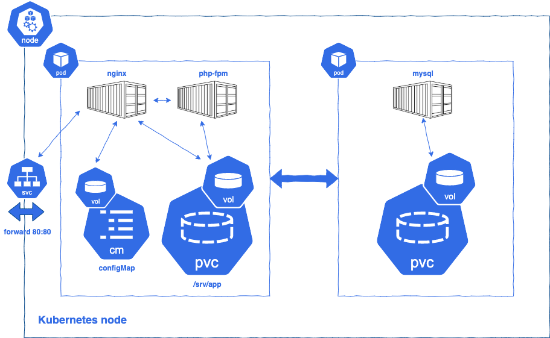

### Background:

1.	Create a new namespace
2.	Deploy MariaDB Statefulset with 3 replicas
3.	Create a MySQL Database named “technical_test”
4.	Create a MySQL user called “technical_test” with password “TkJuDgZLjdc2z4ff” 
5.	Deploy a application pod 2x containers:
    - NGINX
    - PHP
6.	Make the following PHP file accessible publicly through the web and provide the address.
```
<?php
$hostname = "mysql";
$username = "technical_test";
$password = "TkJuDgZLjdc2z4ff";

try {
    $dbh = new PDO("mysql:host=$hostname;dbname=technical_test", $username, $password);
    echo "Connected to database"; // check for connection
    }
catch(PDOException $e)
    {
    echo $e->getMessage();
    }
?>
```


### Below the architecture of Project for Nginx, PHP-Fpm and MySQL on Kubernetes:


